<h1 align="center">
   
  
   
Rapport d'analyse
   
</h1>

<h4 align="center"> Jeremy CATELAIN</h4>

## 0. Introduction
### Contexte
Le gouvernement américain a attaqué en justice cinq grands groupes américains du tabac pour avoir amassé d'importants bénéfices en mentant sur les dangers de la cigarette. Le cigarettiers  se sont entendus dès 1953, pour "mener ensemble une vaste campagne de relations publiques afin de contrer les preuves de plus en plus manifestes d'un lien entre la consommation de tabac et des maladies graves". 

Dans ce procès 14 millions de documents ont été collectés et numérisés. Afin de faciliter l'exploitation de ces documents par les avocats, vous êtes en charge de mettre en place une classification automatique des types de documents. 

Un échantillon aléatoire des documents a été collecté et des opérateurs ont classé les documents dans des répertoires correspondant aux classes de documents : lettres, rapports, notes, email, etc. Vous avez à votre disposition : 

- les images de documents : http://data.teklia.com/Images/Tobacco3482.tar.gz
- le texte contenu dans les documents obtenu par OCR (reconnaissance automatique) : Tobacco3482-OCR.tar.gz  (dans ce git)
- les classes des documents définies par des opérateurs : Tobacco3482.csv (dans ce git)

### Introduction

Le but de ce projet est d'étudier les données que l'on a à notre disposition et trouver un ou des modèles permettant de classifier correctement les documents. Nous commencerons tout d'abord par analyser les données puis étudier quelques modèles de classification. Pour finir, nous allons analyser les résultats. Nous verrons les modèles suivants: 

* Classifieur bayésien multinomial
* MLP 
* Régression logistique
* CNN & Embedding

Les données initiales sont des images de divers documents. Ces dernières ont été traitées par un OCR et chaque image a été convertie en texte afin que nous puissons faire de l'analyse de textes et non d'images. Ainsi, les textes que l'on a ne sont pas toujours correctes en terme de parfaite retranscription, ce qui aura une influence sur la qualité de nos classification. 

### Informations

- Ce rapport contient les commentaires du notebook avec des analyses supplémentaires. 
- Le code script.py est a été utilisé dans l'environnement "env" et suit le style d'écriture PEP8 (score de 9.96). Ce code reprend toutes les méthodes indiquées dans ce rapport. Il est possible d'exécuter qu'une ou plusieurs méthodes. Les méthodes sont indépendantes. 

## 1. Analyse des données 

Nous disposons de 3482 textes provenant d'images après avoir utilisé une technique OCR. Chaque document a un label. Nous comptons 10 labels différents. Il est important de noter que les textes ne sont pas toujours très corrects.

Nous avons pu constater qu'en moyenne, un document a 160 mots différents. Nous avons retiré 1.5% des documents correspondant aux documents ayant au plus deux mots. On a donc décidé de garder tous les documents ayant au moins trois mots. Ce choix peut être justifié par le fait que deux mots ne suffisent pas pour classer un document. De plus, après avoir regardé ces documents, on constate que les deux seuls mots qu'ils ont, sont ininterprétables. Parmi les documents retirés, on constate, par ailleurs, des textes vides. Il était donc préférable de les retirer.

Nous disposons maintenant de 3431 fichiers textes. Visualisons la répartition des différents labels sur l'ensemble de nos documents ainsi que la répartition approximative du nombre de mots par document.
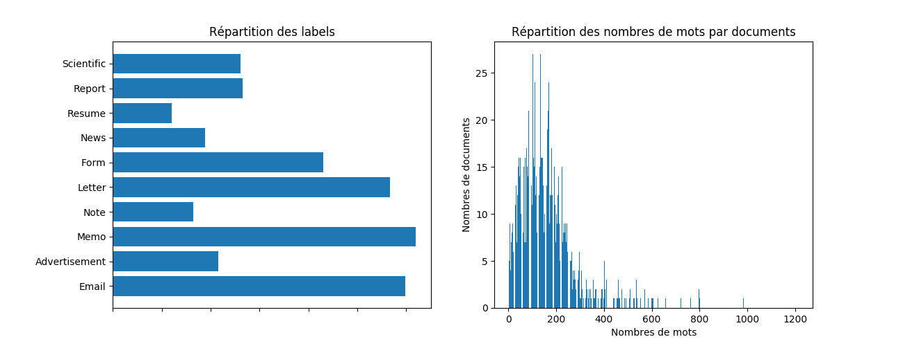 

Les trois labels les plus représentés sont Email, Letter et Memo. Les labels Resume, News et Note sont ceux qui sont les moins présents. Au regard des valeurs des occurrences, on peut dire que les labels sont plutôt bien partagés dans les données (non présence de sur-représentation). 
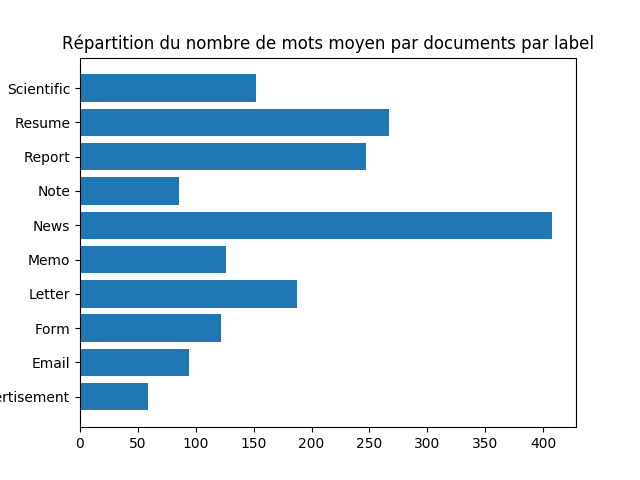
En ce qui concerne le nombre de mots par documents, on remarque que la plupart des documents ont entre 100 et 200 mots. Seuls quelques documents ont un nombre de mots supérieures à 200. On remarque que le nombre moyen de mots par documents ne différent pas considérablement entre les documents de labels différents. Seuls les documents News ont un nombre moyen deux fois plus élevés que les autres. On a donc plus d'informations pour les documents de ce label. Et en général, on a relativement le même quantité d'informations pour chaque label (car l'ordre de grandeur n'est pas très différent selon les labels (entre 50 et 100)). 

Ayant peu de données (inférieur à 1 M d'exemples), nous sommes dans un cas classique de machine learning. On découpe alors nos données de la manière suivante: 

- 60% pour l'ensemble d'apprentissage.
- 20% pour l'ensemble de tests. 
- 20% pour l'ensemble de validation. 

Nous allons découper nos données comme décrit ci-dessus. 
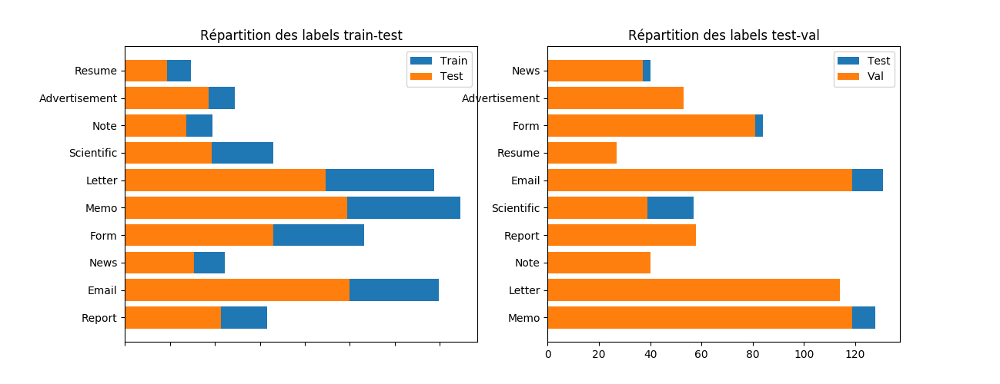  
On voit donc que les données d'apprentissage, de validation et de tests suivent relativement bien la même répartion par rapport aux labels. 

## 2. Classifieur bayésien multinomial

Nous allons commencer par utiliser un classifieur bayésien multinomial avec la représentation TF-IDF. Ce classifieur a pour but de maximiser la classification à partir des probabilités jointes (cad occurrence simultanée d'un mot dans un document et de la classe de ce document).

Nous utilisons CountVectorizer qui encode le texte en utilisant les fréquences des mots. Cependant, les mots très fréquents et figurant dans tous les documents auront un poids important alors qu'ils ne sont pas discriminants. On utilise alors la méthode TF-IDF qui prend en compte le nombre de documents dans lesquels un mot donné apparaît. Un mot qui apparaît dans de nombreux documents aura maintenant un poids moins important. 

Nous utilisons la méthode MultinomialNB sur les données et nous trouvons les résultats suivants: 

* Score = 50% pour les données d'évaluation (46% avec validation croisée)
* Weighted avg = 52 % pour les données test. 

Le rapport de classification est le suivant: 

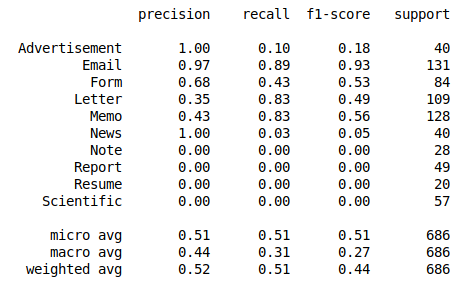 

Les  métriques calculées ne sont pas très bonnes dans l'ensemble. Seulement trois labels ont une précision de plus de 90% (Email, Advertissement et News (même 100% pour les deux derniers)). 4 labels ont une précision de 0% ce qui témoigne du mauvais apprentissage de notre modèle. Nous avons donc un cas de sur-apprentissage. On peut faire les mêmes conclusions pour les métriques Rappel et F1-score. Notre modèle ne classe donc pas bien de nouvelles données. 

Le résultat de macro average est inférieur à celui de micro pour les 3 métriques, donc les documents appartenant aux labels les moins présents dans la base de données sont mal classées, alors qu'ils sont correctement classées pour ceux apparaissant le plus.

Et la matrice de confusion normalisé en pourcentage: 

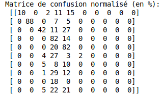 

On constate les mêmes résultats avec la matrice de confusion. Cette dernière n'étant pas diagonale, le classifieur n'est donc pas très bon.

En conclusion, notre modèle ne fonctionne pas très bien malgré un score de 50%. Nous allons donc chercher à l'améliorer en optimisant les hyperparamètres. 

Nous allons optimiser les paramètres de la classification en effectuant une recherche sur grille à l'aide de GridSearchCV. Voici les différents paramètres que l'on va traiter: 
- alpha, le paramètre de lissage pour le classifieur  bayésien. 
- max_features, le nombre maximal de termes les plus fréquents à prendre en compte
- max_df, le seuil à partir duquel on ignore les termes (ceux qui apparaissent dans plus de max_df% des documents).
- utilisation de la répresentation idf ou non. 
- définition de ngram pour le CountVectorizer of TfIDF transformer (unigramme, bigramme..). 

Les meilleurs paramètres trouvés sont les suivants: 

* alpha = 0.1
* pas de TF_IDF
* max_df = 0.4
* représentation bigramme

Nous trouvons les résultats suivants: 

* Score = 71% pour les données d'évaluation (70% avec validation croisée)
* Weighted avg = 73 % pour les données test. 
Le nouveau rapport de classification est le suivant: 

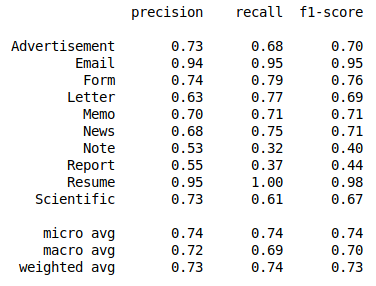 

Les résultats sont beaucoup mieux. On retrouve le même score qu'avec les données d'apprentissage. En moyenne, le rappel, la précésion et le f1-score sont de 73%. Lesrésultatsde macro et de micro average pour les 3 métriques sont plutôt similaires donc le système prédit bien tous les labels, peu importe leur répartition dans la base de données.
Et la matrice de confusion normalisé en pourcentage: 

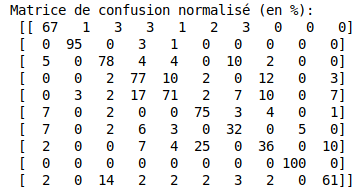 

On constate les mêmes résultats avec la matrice de confusion. Cette dernière est plutôt diagonale, le classifieur est donc relativement bon.

En conclusion, nous avons trouvé un meilleur modèle grâce à l'optimisation des hyperparamètres. En effet, le score a été augmenté de plus de 20 points.

##  3. Classification avec un MLP

Nous allons utilisé un autre type de modèle: celui des réseaux de neurones. Ces derniers peuvent être formés pour apprendre à la fois la représentation vectorielle des mots (au lieu de tf-idf) et la façon de classer les documents. Nous utilisons un Perceptron multicouches avec le sklearn.neural_network.MLPClassifier. Après avoir testé différentes valeurs pour les paramètres suivants: 
- le nombre de couches et le nombre de neurones par couches
- le nombre d'itérations
- alpha, paramètre de régularisation
- fonction d'activation

Nous trouvons un modèle bon avec une couche de 300 neurones et utilisé la fonction d'activation "relu" ainsi que l'optimiseur "adam" (rmsprop + momentum) avec un batch de taille 10 et un paramètre de régularisation valant 0.0001. Au bout de 20 itérations, le coût est de seulement 0.01. 

Nous trouvons les résultats suivants: 

* Score = 78% pour les données d'évaluation.
* Weighted avg = 78 % pour les données test. 
Le rapport de classification est le suivant: 

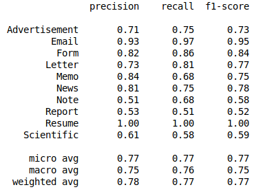 

Et la matrice de confusion normalisé en pourcentage: 

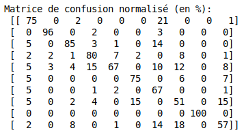

Les valeurs des précisions sont très bonnes. Le modèle prédit bien tous les labels (la précision est légèrement plus faible pour le label Note). En moyenne, le rappel, la précision et le f1-score sont de 76%, ce qui est meilleur que les précédents modèles. Les résultats de macro et de micro average pour les 3 métriques sont plutôt similaires donc le système prédit bien tous les labels, peu importe leur répartition dans la base de données. 

On constate les mêmes résultats avec la matrice de confusion. Cette dernière est plutôt diagonale, le classifieur est donc relativement bon (et meilleur que les précedents modèles). 

## 4. Classification avec régression logistique

Nous allons maintenant étudier la méthode de régression logistique (régression + fonction logistique) qui diffère légèrement du Classifieur multinomial bayésien. En effet, celui-ci a pour but de maximiser la classification à partir des probabilités conditionnelles (et non jointes).

Nous trouvons les résultats suivants: 

* Score = 76% pour les données d'évaluation.
* Weighted avg = 77 % pour les données test. 
Le rapport de classification est le suivant: 

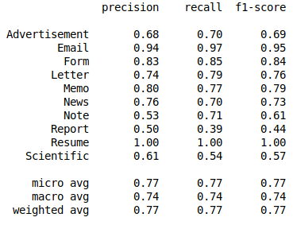 

Et la matrice de confusion normalisé en pourcentage: 

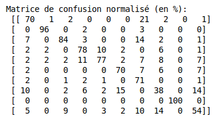

Les valeurs des précisions sont très bonnes. Le modèle prédit bien tous les labels (la précision est plus de 50% pour tous les labels). En moyenne, le rappel, la précision et le f1-score sont de 77%. Les résultats de macro et de micro average pour les 3 métriques sont plutôt similaires donc le système prédit bien tous les labels, peu importe leur répartition dans la base de données. On constate les mêmes résultats avec la matrice de confusion. Cette dernière est plutôt diagonale, le classifieur est donc relativement bon (et meilleur que les précedents modèles). 

## 5. Classification avec un CNN

Nous allons maintenant créer un classifieur de texte avec un réseau de neurones à convolutions en utilisant un plongement de mots (word embedddings). On utilise un réseau à convolutions avec une grille d'une dimension car nos données sont des séquences. Ce type de réseau part du principe que la détection de feature est important pour la classficiation.

On effectue ce type de réseau avec les paramètres suivants: 

* Taille du vocabulaire = 2000
* Longueur max d'un texte = 1213
* Embed_size = 300
* Nombre de filtres = 125

Voici la structure du modèle: 

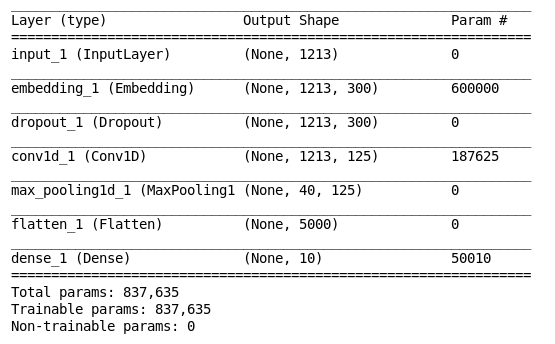

Nous trouvons les résultats suivants: 

* Score = 74% pour les données d'évaluation.
* Weighted avg = 74 % pour les données test. 
Le rapport de classification est le suivant: 

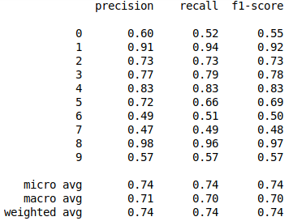 

Et la matrice de confusion normalisé en pourcentage: 

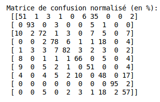

Les valeurs des précisions sont très bonnes. Le modèle prédit bien tous les labels (la précision est plus de 50% pour tous les labels). En moyenne, le rappel, la précision et le f1-score sont de 74%. Les résultats de macro et de micro average pour les 3 métriques sont plutôt similaires donc le système prédit bien tous les labels, peu importe leur répartition dans la base de données. On constate les mêmes résultats avec la matrice de confusion. Cette dernière est plutôt diagonale, le classifieur est donc relativement bon (et meilleur que les précedents modèles). 

## 6. Conclusion

### Analyses des résultats
Voici les scores trouvés pour les différents modèles utilisés. 

| Modèle      |     Weight average    |   Score |
| ------------- |: -------------: | ---------: |
| MultinomialNB      |        73%        |      71% |
| MLPClassifier        |        78%        |      78% |
| LogisticRegression      |       77%        |      76% |
| CNN + Embedding      |        74%        |      74% |

Nous pouvons donc dire que les modèles crées donnent relativement les mêmes résultats. Le meilleur modèle semble être celui de MLP. Le moins bon est celui avec le classifieur bayéssien (alors qu'il a été optimisé). La représentation TF_IDF ainsi que les probabilités jointes ne semblent donc pas être les meilleures méthodes à appliquer pour faire de la classification sur nos données, alors que les réseaux de neurones (MLP ou CNN) et la régression semble être les meilleurs méthodes.

En moyenne, on peut dire que la précision d'un modèle est de 75%. En ayant créée 4 modèles, on peut voir que les précisions sont très proches même avec une optimisation. On peut donc supposer que l'on est proche du niveau de précision maximale qu'un modèle peut atteindre avec ces données. 

On a aussi pu remarquer que les modèles prédisent très bien certaines classes contrairement à d'autres. Pour toutes les méthodes, les meilleurs labels prédits sont Email et Resume. Les moins bien prédits sont Note et Report. Ces résultats sont intéressants: 

* Email est le label le plus représenté alors que Resumé est celui le moins représenté. Cependant, ils sont tous les deux les mieux prédit. Le résultat est donc dû à la qualité des textes OCR ou de la quantité d'informations dans les documents. On a pu remarqué que Resume faisait partie des documents ayant le plus de mots par documents tandis qu'il s'agit du contraire pour Email. On a donc deux cas opposés ayant la même qualité de prédiction. On en conclut que: Resume est peu représenté mais sur ce peu de documents, les textes contiennent beaucoup de mots et probablement de bonnes qualités. En ce qui concerne Email, ce label a beaucoup de documents mais chaque document contient très peu de mots. Cependant, il est probable que ces mots soient de très bonnes qualités en terme d'OCR ou d'informations. Cette analyse est plutôt logique car les emails sont des textes courts facile à traiter puisqu'il s'agit d'écritures numériques.

* Note et Report sont moyennement représentés. Report a légèrement plus de documents. Cependant, Note a beaucoup de mots que Report. Leurs scores sont de 50%. Ce résultat n'est pas mauvais mais n'est pas le meilleur. Ce score est correct puisqu'il est supérieur à l a probabilité de tirer aléatoirement un label parmi les 10. On peut dire que les documents Note ont peu de mots et que ces derniers sont de mauvaises qualités en terme d'OCR ou d'informations. Il est aussi probable que les documents Report contiennent beaucoup de mots mais que très peu soient de qualités. 

On peut donc dire que les résultats sont biaisés par la qualité de la technique OCR mais aussi par la qualité des informations dans les documents. 

### Piste d'améliorations

Nous avons pu voir que le modèle Perceptron Multi-Couche est le meilleur. On pourrait l'améliorer davantage en utilisant Keras avec des couches Dense et d'autres fonctions d'activation que celles proposées par sklearn.MLP. Nous ne connaissons pas d'autres modèles pour traiter ce genre de problème (classification de texte). La meilleur méthode pour améliorer nos précisions est la modification des données traitées. Il serait notamment judicieux d'essayer d'améliorer  la technique OCR utilisée. En effet, certaines images ont été très mal retranscriptes. Certaines textes sont vides ou ininterprétables.

La technique OCR pourrait être par exemple un réseau de neurones à convolutions en deux dimensions (traiter les caractéristiques) associé à un réseau de neurones récurrents (pour traiter le contexte). On pourrait tester cette technique avec un modèle CTC (traitement de séquences). Par exemple, pour le projet du cours de Sequential Data Analysis, le modèle que j'ai crée (CNN+RNN avec CTC) a atteint un taux de bonne reconnaissance de mots sur des images égal à 60% et un taux de bonne reconnaissance de caractère égal à 73% (résultats sont cohérents avec ceux trouvés par les chercheurs dans ce domaine). 

De plus, il serait aussi nécéssaire d'avoir des données avec une meilleur répartition. Il faudrait alors avoir plus de données afin d'avoir une répartition des labels plutôt similaires dans les données.

